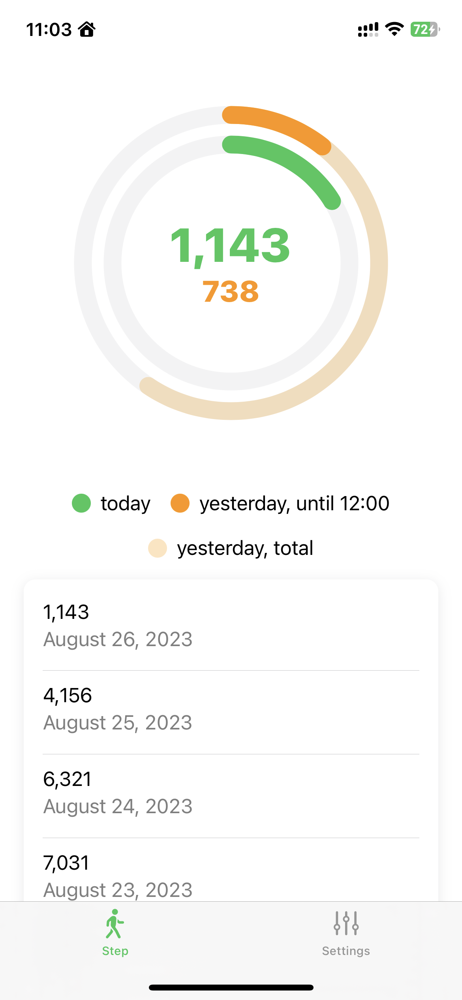
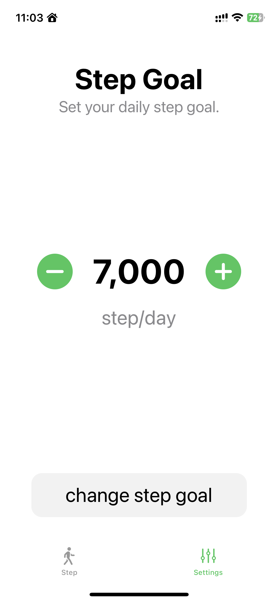

# Steps
### コンセプト
昨日の自分と歩数を比較することで、歩数の促進を図ります。

当日の歩数に加えて、
- 前日の同時間帯の歩数
- 前日の全歩数

を表示しており、それぞれ
- 過去の自分との比較による歩数促進
- 昨日の全歩数を所有化することで、歩数促進（[エンダウンメント効果](https://www.kcsf.co.jp/marketing/endowment.html)）

を図っています。

### UI
**動画**

<video src="RPReplay_Final1693015429.mp4" controls title="Title" width="500" height="375"></video>

**トップ画面**

**設定画面**

### 今後の更新
特にエンダウメント効果について、設計が甘いことを自覚しています。
昨日歩いた歩数の「所有化」をしてもらうためのUXを考えています。
